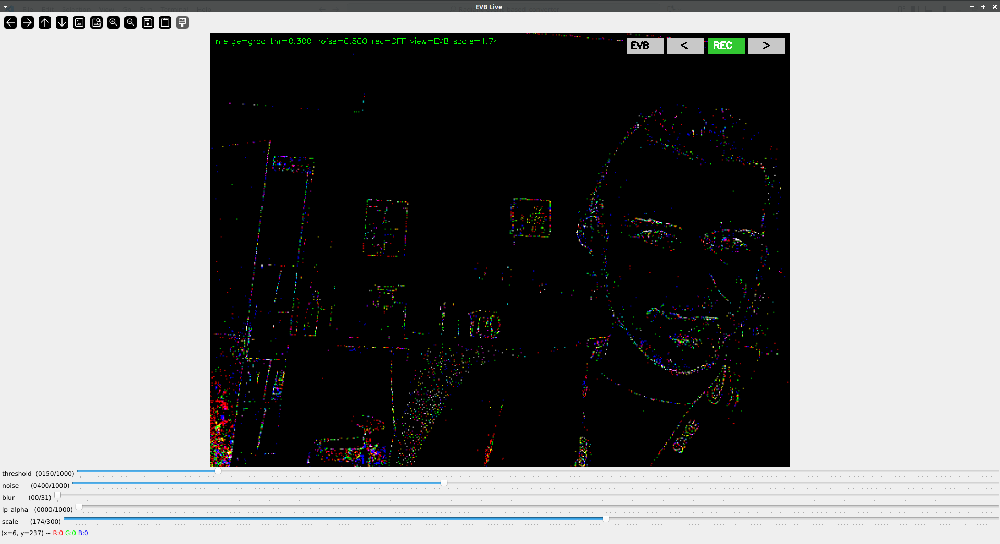

# Radiant EVB Model

An event-based camera converter for RGB video.

## How to Use

### Python Environment Setup

To install the project with `uv`:

# Radiant EVB Model

An event-based camera converter for RGB video.

## How to Use

### Python Environment Setup

To install the project with `uv`:

1. If you don't have `uv`, install it using:
  ```bash
  pip install uv
  ```
2. Clone the project repository.
3. Run:
  ```bash
  uv sync
  ```
4. Use the `uv` command as shown in the examples below.

### Usage

Run the following command to convert an RGB video to an event-based video:

```bash
python ./video_converter.py [-h] [--output_path OUTPUT_PATH] [--threshold THRESHOLD] [--noise_level NOISE_LEVEL] [--merge_method MERGE_METHOD] [--fps FPS] [--change_input_rate] [--input_rate INPUT_RATE] [--save_spike_mat] video_path
```

#### Positional Arguments:
- `video_path`: Path to the video to convert.

#### Optional Arguments:
- `-h, --help`: Show the help message and exit.
- `--output_path OUTPUT_PATH`: Path to the output video.
- `--threshold THRESHOLD`: Threshold for the event camera.
- `--noise_level NOISE_LEVEL`: Noise level for the event camera.
- `--merge_method MERGE_METHOD`: Method to merge the channels to RGB. Options: `"first_channel"`, `"polarity"`, or `"channel"`.
- `--fps FPS`: Frames per second of the output video.
- `--change_input_rate`: Change the input rate of the video.
- `--input_rate INPUT_RATE`: Input rate of the video (convert every n frames).

### Examples

```bash
uv run ./video_converter.py ./video_sources/video_name.mp4 --merge_method channel --save_spike_mat
```

```bash
uv run ./video_converter.py ./video_sources/video_name.mp4 --merge_method channel --fps 8 --change_input_rate --input_rate 20
```

## Live USB camera (interactive)

This repository also includes an interactive live viewer that reads from a USB camera, converts frames to an event-based representation using the `cam_evb` class and displays a live visualization with on-screen controls.

Run the live viewer:

```bash
python live_converter.py --camera 0 --output ./video_out
```

Command-line options:
- `--camera`: Camera index for OpenCV `VideoCapture` (default 0).
- `--output`: Directory where recordings are saved (default `./video_out`).
- `--threshold`: Initial event threshold (default 0.3).
- `--noise`: Initial noise level (default 0.8).
- `--fps`: Optional target FPS for recordings (defaults to camera FPS).

Interactive controls (on-screen buttons / keyboard):
- Mouse: click on the top-right buttons:
  - VIEW / EVB: toggle between filtered RGB preview and event-based visualization
  - `<` / `>` : cycle the merge/visualization method
  - REC: start/stop recording
- Keyboard shortcuts:
  - `q`: quit
  - `SPACE`: toggle recording
  - `v`: toggle view between RGB and EVB
  - `m`: cycle merge method
  - `y` / `r`: increase / decrease threshold
  - `n` / `b`: increase / decrease noise

Sliders (trackbars) in the window:
- `threshold`: event camera threshold (mapped 0..1000 → 0..2.0)
- `noise`: additive noise level (mapped 0..1000 → 0..2.0)
- `blur`: spatial low-pass kernel size (0..31, odd sizes; 0 = disabled)
- `lp_alpha`: temporal low-pass alpha for EMA smoothing (0..1000 → 0.0..1.0; 0 = disabled)
- `scale`: preview scale (100..300 → 1.0..3.0) — scales the preview window and UI

Notes:
- The displayed frame is the filtered RGB frame or the EVB visualization depending on VIEW. Recording saves the currently displayed image.
- Recorded files are written to the `--output` directory and named like `evb_record_YYYYmmdd_HHMMSS_<merge>.mp4`.
- By default the writer saves the scaled preview frames. If you prefer recordings at the original camera resolution, edit `live_converter.py` where the VideoWriter is created (use `display_img.shape` vs camera frame size).

Dependencies (suggested):
```bash
pip install opencv-python torch numpy
```

Utilities:
- To probe available camera indices use the included `list_cameras_probe.py` or run a quick OpenCV probe script.

Visual examples
----------------

The repository includes example images used by the viewer UI. They live in `img_src/` and are shown below as examples.

RGB mode:


Blue / gradient mode:


White mode:


Window icon (for reference):



## Citation

If you use this Event-Based Converter Model Camera in your work, please cite it as follows:

### BibTeX Citation:
```bibtex
@article{courtois2025spiking,
  title={Spiking monocular event based 6D pose estimation for space application},
  author={Courtois, Jonathan and Miramond, Benoît and Pegatoquet, Alain},
  journal={arXiv preprint arXiv:2501.02916},
  year={2025}
}
```

### MLA Citation:
Courtois, Jonathan, Benoît Miramond, and Alain Pegatoquet. "Spiking monocular event based 6D pose estimation for space application." *arXiv preprint arXiv:2501.02916* (2025).
